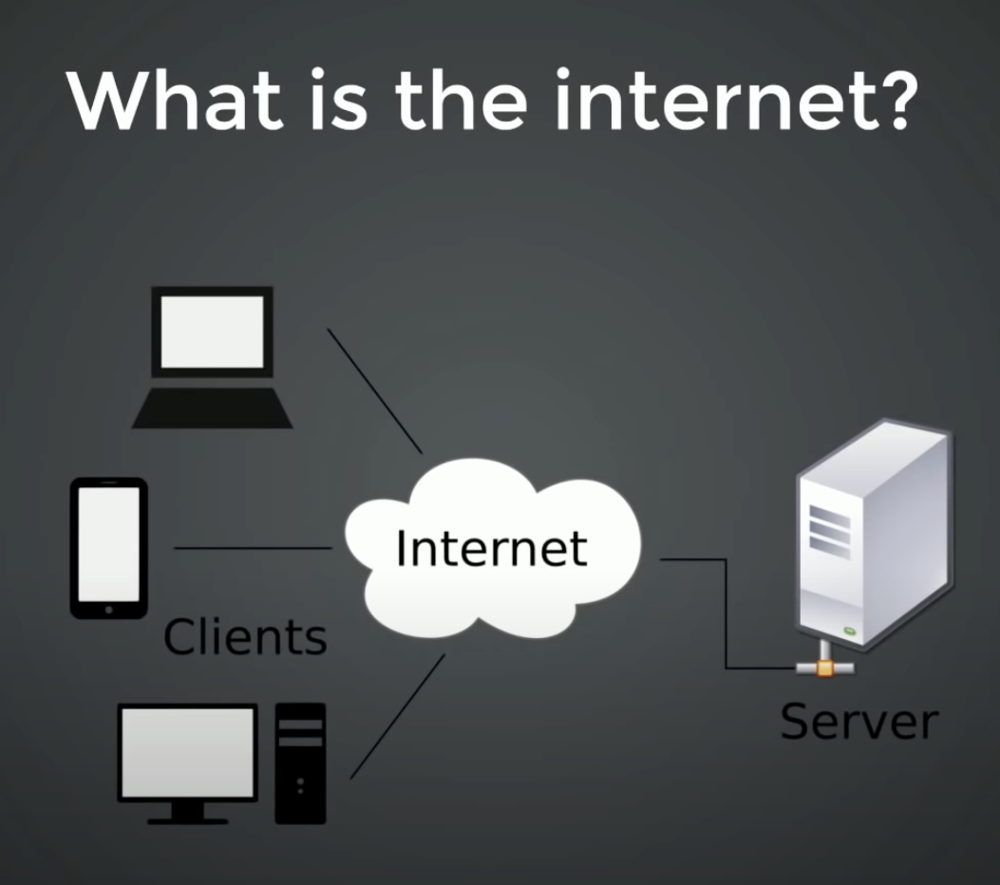

<h1 style='text-align:center'>Lesson 1</h1>

## What are Developers?
In short, they build things by giving instructions to a computer. There are many different types of developers. For example, web developers build and maintain websites. They create the instructions that show words on a web page, colors and images, font types, etc. They also write code that allows you do things on a website, from pushing buttons to playing games.

[What does code look like?](https://github.com/mhjarvis/odin-projects/blob/main/odin-library/main.js)

* Do basic_program example.

## What is a Computer?
A computer is an electronic device that works with data. It can store, retrieve, and process data. To keep it simple, when we work with a computer, that computer (the processor) takes 0s and 1s (using electricity or voltage), does a bunch of calculations, and provides back a result. We can display this in binary form:

    1001010100011011011011010110

    0001 = 1
    0010 = 2
    0011 = 3
    0100 = 4

## What is the Internet?

