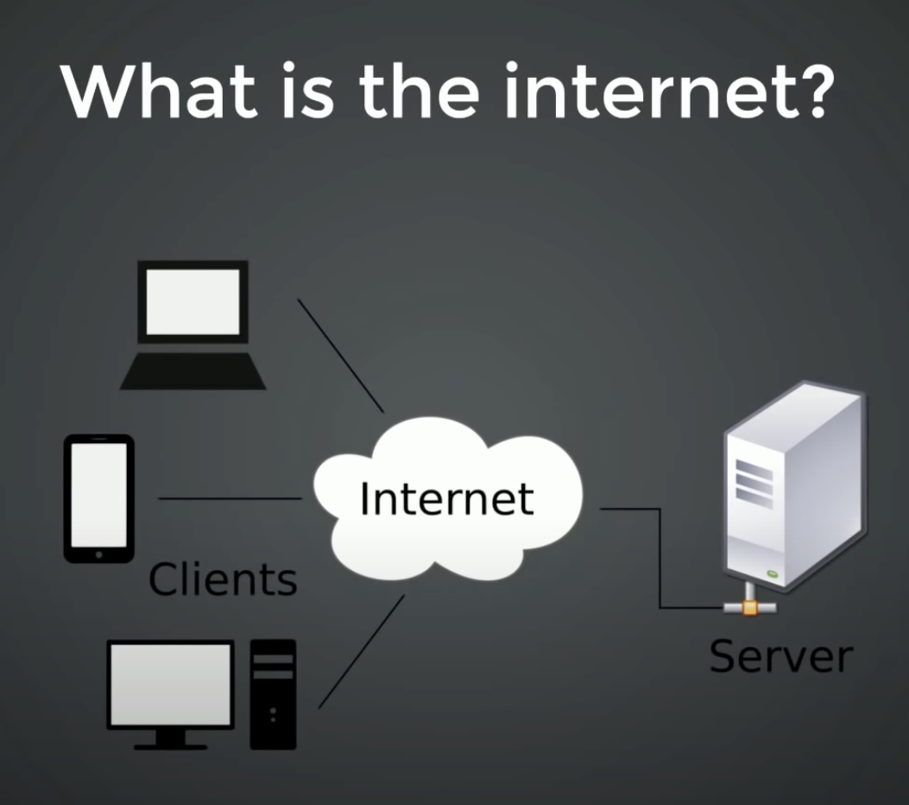

<h1 style='text-align:center'>Lesson 1</h1>

## What are Developers?
In short, they build things by giving instructions to a computer. There are many different types of developers. For example, web developers build and maintain websites. They create the instructions that show words on a web page, colors and images, font types, etc. They also write code that allows you do things on a website, from pushing buttons to playing games.

[What does code look like?](https://github.com/mhjarvis/odin-projects/blob/main/odin-library/main.js)

* Do basic_program example.

## What is a Computer?
A computer is an electronic device that works with data. It can store, retrieve, and process data. To keep it simple, when we work with a computer, that computer (the processor) takes 0s and 1s (using electricity or voltage), does a bunch of calculations, and provides back a result. We can display this in binary form:

    1001010100011011011011010110

    0001 = 1
    0010 = 2
    0011 = 3
    0100 = 4

* What is a computer?
* What is an operating system?
* What is an application?

## What is the Internet?
The internet is nothing more than a giant network. Your computer connects to a router which essentially connects to a wire that leads to your internet service provider. These connect to other providers, etc., all the way to another computer on the other side of the world (think of a giant spiderweb or the roads we travel on).  

Take an email as an example (not extirely accurate). When you send an email, your computer breaks down the words and pictures in an email into thousands and thousands of sets of numbers. These numbers then get sent to your router which then sends it to other routers until it finally reaches the email account of the person your sending it to. It does this exremely extremly fast. The receiving computer then takes all those numbers, does some math, and displays it on your screen for you to see and work with.

What we are going to learn about is web pages, which is usually what people think about when they hear the word internet.



* What is a network?
* What is a router?
* How is data transferred?
* What is a web page?

## Installation
In order to build webpages, we will need tools to do so. We will be using the following tools to start with:

1. A web browser.
2. A code editor - Visual Studio Code.

A code editor is what we will use to write our code. It will help us find errors when we make them, and it will help us turn all that code we write into a form that a computer can understand.

[Download VSCode](https://code.visualstudio.com/)

Add ```Live Server``` to VSCode.